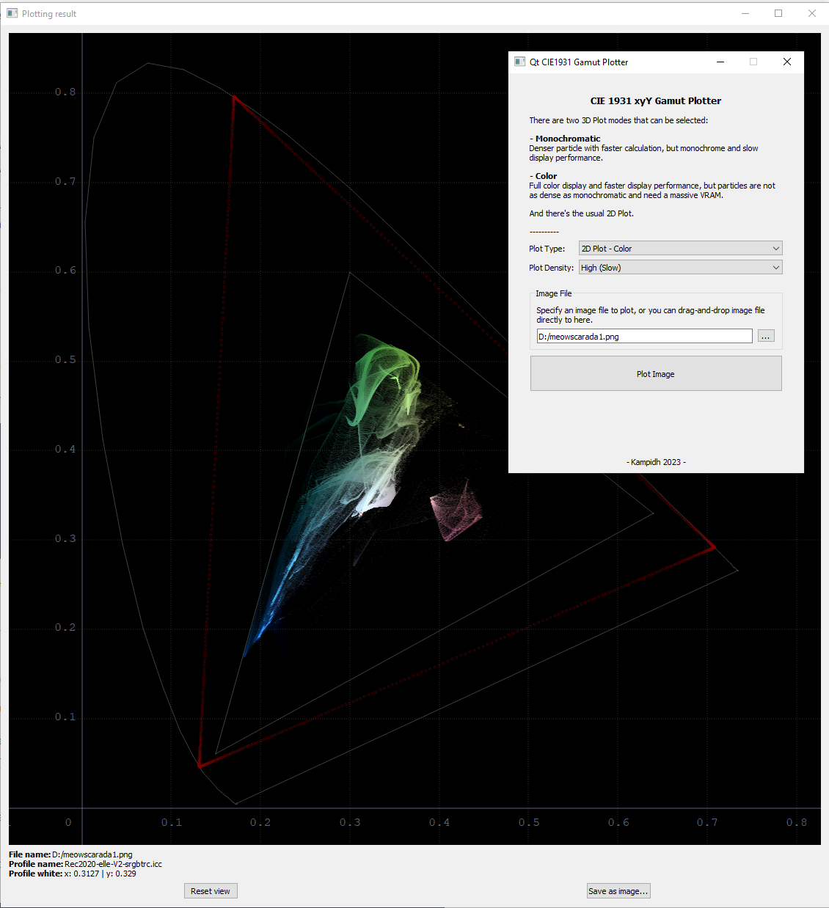

# Color-Gamut-Plotter Qt Version
Another take in color gamut plotting but with Qt frameworks instead.

Written in C++ with Qt 5.15.2 and build with MingW 64-bit kit.

Image loading is currently handled with QImage. 
Color transformation handled with lcms2. 
3D plotting handled with Qt Data Visualization. 
2D plotting handled with custom QWidget inspired by Krita Tongue Widget. 

lcms2 dependency borrowed from Krita.

To build:
- Open the project in Qt Creator
- Build project after configuring it, at first only the 3rdparty will be build
- There will be an error that lcms2 is not found
- Rerun CMake again
- Rebuild project to build the binaries
